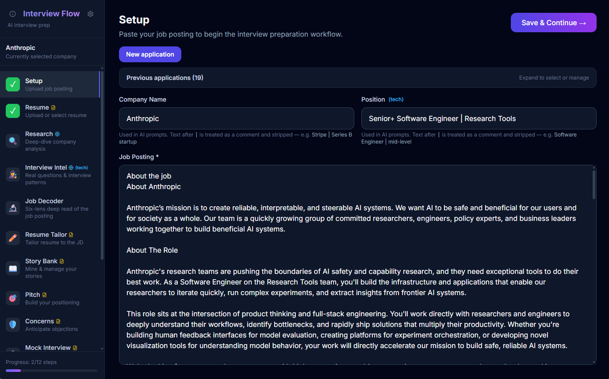

# Interview Flow


AI-powered interview coaching that helps you prepare for job interviews end-to-end — from company research to salary negotiation.

Based on the original version by [Prasad Apparaju](https://github.com/Prasad-Apparaju), inspired by the research article [How to Use AI for your next job interview](https://www.lennysnewsletter.com/p/how-to-use-ai-in-your-next-job-interview)



Built with Python/FastAPI, it runs locally on your machine. Your data stays on your computer. Choose from multiple AI backends — Claude (Anthropic), GPT (OpenAI), or a fully local model via Ollama — all configurable from the in-app settings page without editing config files.

## What It Does

The app walks you through an 11-step interview prep workflow:

| Step | What It Does |
|------|-------------|
| **Setup** | Paste a job posting (or a URL to it) and enter company/role details |
| **Resume** | Upload or paste your resume; select from previously saved resumes |
| **Research** | AI agent researches the company using web search — culture, tech stack, red/green flags, fit score |
| **Interview Intel** | Mines Glassdoor, Blind, Reddit, and Levels.fyi for real interview questions, hiring patterns, and candidate experiences |
| **Job Decoder** | Analyzes the job description through 6 lenses — hidden requirements, emphasis signals, verb patterns, what's missing |
| **Resume Tailor** | Reviews your resume against the job description and rewrites it as a tailored draft to make it more relevant to the job posting. Use the interactive chat coach to refine specific bullets or sections. Export the finished resume as a `.docx` file using your own Word template for styling |
| **Story Bank** | Mines your resume for STAR stories with "earned secrets" — the spiky insights only you would know |
| **Pitch** | Generates 10s, 30s, 60s, and 90s pitch variants tailored to the role |
| **Concerns** | Anticipates what the interviewer might worry about and gives you counter-evidence scripts |
| **Mock Interview** | Multi-turn mock interview with scoring across 5 dimensions + detailed debrief |
| **Salary** | Market range, negotiation scripts, pushback responses, and red lines |

There's also a **Debrief** step for post-interview reflection.

Each step is powered by an AI agent. Results are saved automatically so you can close the browser and come back later.

## AI Providers

The app supports three AI backends, switchable from the **Configuration** page at any time. Anthropic and OpenAI require you to provide your own API key — the app has no built-in key and makes no requests on your behalf.

| Provider | Setup | Cost | Web Search |
|----------|-------|------|------------|
| **Anthropic (Claude)** | Your own Anthropic API key | Pay-per-use | Via Anthropic web search tool |
| **OpenAI (GPT)** | Your own OpenAI API key | Pay-per-use | Via OpenAI web search tool |
| **Ollama (local)** | [Ollama](https://ollama.com) installed + model pulled | Free | Via DuckDuckGo (no API key needed) |

### Running fully local with Ollama

1. Install [Ollama](https://ollama.com) and pull a model:
   ```bash
   ollama pull gemma4:31b       # good general-purpose model with tool support
   ```
2. Start the app and open **Configuration → Ollama**
3. Set the server URL (default `http://localhost:11434`) and select your model
4. Switch the active provider to **Ollama**

All sections work with Ollama. Sections that require web search (Research, Interview Intel, Salary) use DuckDuckGo automatically — no API key required. These sections are marked with a globe icon (🌐) in the UI.

> **Note:** Web search via DuckDuckGo requires a model with tool-calling support. The model dropdown shows which models support tools (`· tools ✓`). If your selected model lacks tool support, a warning is shown and web-search sections will answer from the model's training data only.

## Quick Start

### Prerequisites

- **Python 3.10+** (check with `python3 --version`)
- **An API key or local model** — see [AI Providers](#ai-providers) below

### Run modes

> **API keys are optional at startup.** You can enter or change your API key (and all other provider settings) at any time from the **Configuration** page inside the app. The `.env` file is just a convenience — the app works fine without it.

**Desktop app** (native window — no browser needed):

```bash
# Mac / Linux
python -m app.desktop

# Windows — double-click or run from a terminal
flow.cmd
```

`desktop.py` starts the server in a background thread and opens the app in a native window (Edge WebView2 on Windows, WKWebView on Mac, WebKitGTK on Linux). On Windows, `flow.cmd` starts the backend terminal minimized. If no GUI backend is available (WSL, headless server), it falls back to browser mode automatically.

**Server + browser** (classic mode):

```bash
git clone https://github.com/loxsmoke/interview-flow.git
cd interview-flow
bash flow.sh
```

The script creates a virtual environment, installs dependencies, and starts the server at **http://localhost:8000**. Optionally copy `.env.example` to `.env` and pre-populate your API key — otherwise set it from the Configuration page after the app opens. Running `python -m app.main` directly also auto-loads `.env`.

**Standalone executable** (no Python required):

Build with PyInstaller using the included spec file:

```bash
pip install pyinstaller
pip install -r requirements.txt
pyinstaller interview_flow.spec
```

Output is `dist/InterviewFlow/InterviewFlow.exe` on Windows or `dist/InterviewFlow.app` on Mac. Optionally place a `.env` file next to the executable to pre-populate settings; otherwise configure everything from the app's Configuration page. Interview sessions are saved in a `data/` folder beside the executable.

### Stop

Press `Ctrl+C` in the terminal (or close the native window in desktop mode).

## How to Use

1. **Start a new workflow** — Enter a company name, paste the job posting (or a URL to it), and upload/paste your resume
2. **Work through the steps** — The sidebar shows your progress. Click any unlocked step to run it
3. **Run agents** — Each step has a "Run Agent" button. Results render as formatted markdown with diagrams
4. **Mock interviews** — Choose a format (behavioral, system design, case study, panel, or bar raiser), then have a real back-and-forth conversation. After 4-6 questions you get a scored debrief
5. **Resume chat** — After the AI reviews your resume, use the interactive chat to rewrite specific bullets or sections
6. **Track multiple opportunities** — The home page lists all your saved workflows. Click one to resume

## Project Structure

```
interview-flow/
  app/
    main.py                # FastAPI server — all routes
    desktop.py             # Native desktop launcher (WebView2 / WKWebView)
    models.py              # Pydantic data models
    state.py               # Persistent state manager (JSON on disk)
    queue_manager.py       # Background agent queue
    prompt_loader.py       # Loads and renders prompt templates
    tracing.py             # Langfuse observability (optional)
    section-headings.md    # Resume section heading → type mapping
    agents/
      streaming.py         # Streaming helpers and provider abstraction
      research.py          # Company research and interview intel agents (web search)
      story_miner.py       # Story extraction, job description decode, salary, concerns, pitch
      mock_interview.py    # Multi-turn mock interview with scoring
      resume_chat.py       # Interactive resume coaching chat
    prompts/               # Agent system prompt templates (markdown)
    static/
      index.html           # Single-page React frontend
  tests/
    app/                   # Python unit tests (pytest)
    e2e/                   # End-to-end UI tests (Playwright)
      server.py            # Mock FastAPI server used by e2e tests
    playwright.config.ts   # Playwright configuration
    test-app.sh / .cmd     # Run unit tests
    test-e2e.sh / .cmd     # Run e2e tests (auto-installs dependencies)
  docs/                    # Architecture and design docs
  data/                    # Saved workflows and templates (gitignored)
```

## Running Tests

### Python app tests

```bash
# Mac / Linux
bash tests/test-app.sh

# Windows
tests\test-app.cmd
```

Or run pytest directly:

```bash
python -m pytest tests/app -v
```

### E2E tests (uses mock agents — no API key needed)

```bash
npm install
npx playwright install chromium
npm run test:e2e
```

## Optional: Langfuse Observability

To trace AI agent calls with [Langfuse](https://langfuse.com), set these environment variables before starting:

```bash
export LANGFUSE_PUBLIC_KEY=pk-...
export LANGFUSE_SECRET_KEY=sk-...
export LANGFUSE_BASEURL=https://cloud.langfuse.com  # or your self-hosted URL
```

This is entirely optional — the app works fine without it.

## Notes

- All data is stored locally in `data/*.json` — nothing leaves your machine except API calls to your chosen AI provider
- With Ollama, inference runs entirely on your machine — no data leaves at all (DuckDuckGo search queries are the only external calls)
- The server binds to `127.0.0.1` (localhost only) — not accessible from other machines on your network
- Each workflow is independent — you can prep for multiple jobs simultaneously
- API keys entered via the Configuration page are saved to `.env` in the app directory for persistence across restarts
