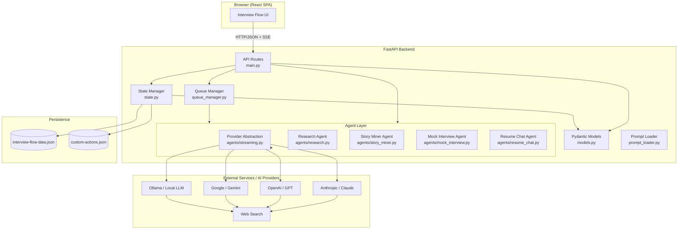
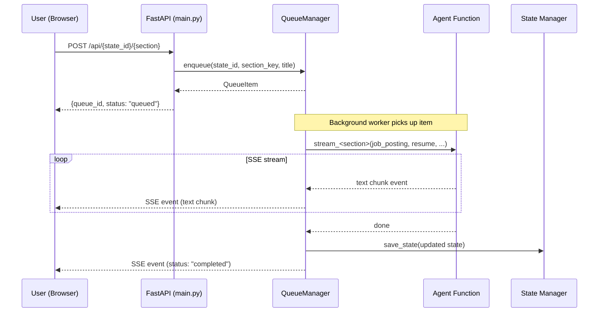
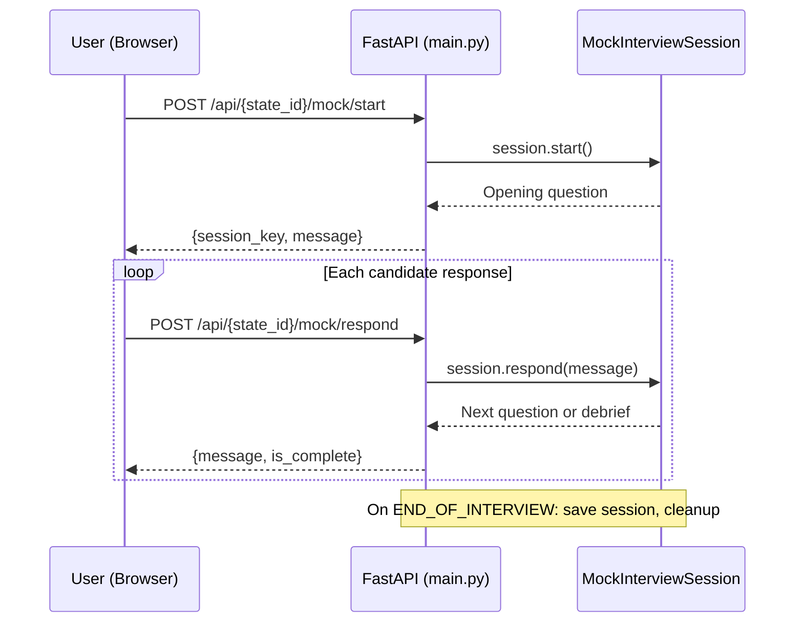
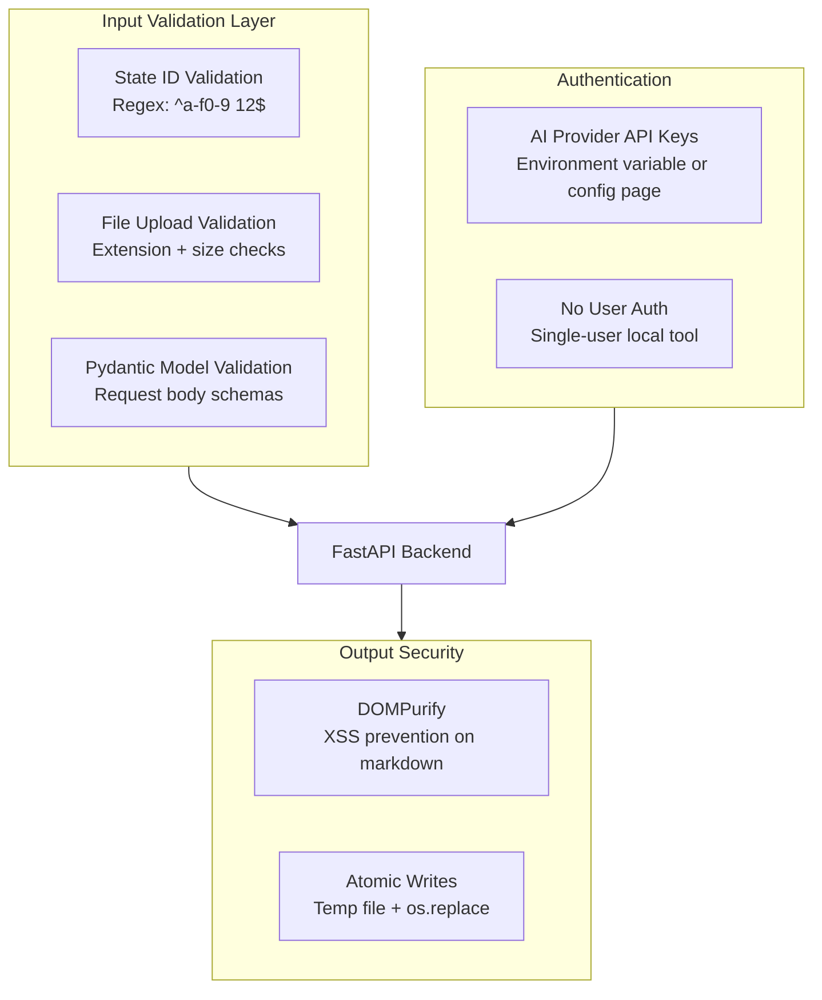

# Interview Flow — High-Level Design

## Executive Summary

Interview Flow is an AI-powered interview preparation system that guides candidates through a structured, multi-step coaching process for job interviews. It combines company research, interview intel mining, job description analysis, story mining, resume tailoring, mock interviews, salary coaching, and pitch building into a single workflow.

The system is a **Python/FastAPI backend** with a **React single-page frontend** served as a static HTML file. State is persisted to a single combined JSON file on disk. Each AI-powered step delegates to a specialized agent via an abstracted provider layer that supports Claude (Anthropic), GPT (OpenAI), Gemini (Google), and Ollama (local).

**Key inspiration**: [Lenny's Newsletter — How to use AI in your next job interview](https://www.lennysnewsletter.com/p/how-to-use-ai-in-your-next-job-interview) — the "Earned Secrets" framework, six-lens JD decoding, and multi-format mock interviews.

---

## System Architecture

---

## Component Overview

| Component | File(s) | Responsibility |
|-----------|---------|----------------|
| **API Routes** | `app/main.py` | HTTP endpoints, request validation, queue submission, orchestration |
| **Queue Manager** | `app/queue_manager.py` | Background processing of agent tasks, SSE event streaming to frontend |
| **Pydantic Models** | `app/models.py` | Data schemas for all domain objects |
| **State Manager** | `app/state.py` | Atomic JSON persistence, state ID validation, custom actions persistence |
| **Prompt Loader** | `app/prompt_loader.py` | Load agent prompt templates from disk |
| **Provider Abstraction** | `app/agents/streaming.py` | Provider selection (Claude/OpenAI/Gemini/Ollama), streaming helpers, cost tracking |
| **Research Agent** | `app/agents/research.py` | Company deep-dive research using web search |
| **Story Miner Agent** | `app/agents/story_miner.py` | STAR story extraction, JD decoding, salary coaching, concern anticipation, pitch building, interview intel |
| **Mock Interview Agent** | `app/agents/mock_interview.py` | Multi-turn interview simulation with scoring and debrief |
| **Resume Chat Agent** | `app/agents/resume_chat.py` | Interactive resume coaching via back-and-forth conversation |
| **Desktop Launcher** | `app/desktop.py` | Native desktop window (Edge WebView2 / WKWebView) |
| **Frontend** | `app/static/index.html` | React SPA with step-by-step wizard UI, markdown rendering, chat interface |

---

## Workflow Steps

Steps can be executed in any order after Setup, but the recommended flow above builds context progressively — later steps benefit from earlier outputs.

---

## Data Flow

### Queue-Backed Agent Execution

Long-running agent tasks are dispatched through the queue manager rather than executed synchronously.

### Mock Interview (Multi-Turn)

---

## Integration Points

| Integration | Protocol | Purpose |
|-------------|----------|---------|
| **Anthropic / Claude** | Python SDK async API | Primary AI provider for all agents |
| **OpenAI / GPT** | Python SDK async API | Alternative AI provider |
| **Google / Gemini** | Python SDK async API (`google-genai`) | Alternative AI provider with Google Search grounding |
| **Ollama** | HTTP API (local) | Local LLM option, no API key required |
| **Web Search** | Provider-native tools (WebSearch/WebFetch) or DuckDuckGo | Used by research agent and salary coach |
| **File System** | Local disk I/O | JSON state persistence in `data/` directory |
| **Browser** | HTTP/JSON + SSE + static HTML | Single-page React app served by FastAPI |
| **Langfuse** | Python SDK | Optional observability / tracing |

---

## Security Architecture

**Key security decisions**:
- **No user authentication** — designed as a single-user local tool. API keys are held in environment variables or set via the configuration page at runtime; never sent to the frontend.
- **Path traversal prevention** — state IDs are validated against `^[a-f0-9]{12}$` before any filesystem operation.
- **Atomic writes** — state is written to a temp file then renamed, preventing corruption on crash.
- **XSS prevention** — frontend renders markdown through DOMPurify before inserting into DOM.
- **File upload validation** — extension allowlist, 10 MB size limit, text extraction with error handling.
- **CORS** — restricted to localhost origins.

---

## Scalability Considerations

This is a **single-user local tool**, not a multi-tenant service. Design choices reflect that:

| Aspect | Current Approach | If Scaling to Multi-User |
|--------|-----------------|--------------------------|
| **State storage** | Single combined JSON file | Migrate to PostgreSQL or similar |
| **Mock sessions** | In-memory dict | Redis or database-backed sessions |
| **Concurrency** | Single global asyncio.Lock (shared file) | Database-level row locking |
| **Auth** | None (local only) | Add user auth + state ownership checks |
| **File uploads** | Server-local processing | Object storage (S3) + async processing |
| **Agent calls** | Single-item queue (one task at a time) | Multi-worker queue with rate limiting |

---

## Design Decisions

| Decision | Rationale | Alternatives Considered | Revisit When |
|----------|-----------|------------------------|--------------|
| Single combined JSON file | Simpler than per-state files; one atomic write covers all state | Per-state files, SQLite, PostgreSQL | Multi-user or >1000 states |
| Single-file frontend | Zero build step, easy to ship | Next.js, Vite SPA | Need routing, SSR, or complex state management |
| Abstracted provider layer | Supports Claude, OpenAI, Gemini, and Ollama from one interface | Direct SDK calls, LangChain | New provider with incompatible interface |
| Queue-backed agent execution | Decouples HTTP request lifetime from agent runtime; supports SSE progress streaming | Synchronous blocking endpoints | Truly parallel multi-user workloads |
| In-memory mock sessions | Stateful multi-turn needs persistent connection | Database-backed conversation | Server restarts losing sessions becomes a problem |
| Atomic file writes | Prevent corruption without DB transactions | File locking (fcntl), SQLite | Moving to database storage |
