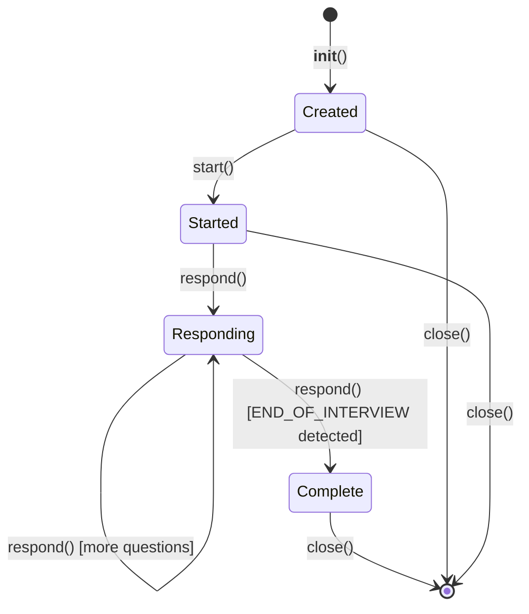

# Mock Interview Agent — Low-Level Design

**File**: `app/agents/mock_interview.py`

## Overview

Manages multi-turn mock interview simulations. Unlike the stateless agent functions in `story_miner.py`, this maintains persistent conversation state across multiple user responses using the provider abstraction in `agents/streaming.py`.

## Class: MockInterviewSession

### Constructor

```python
MockInterviewSession(
    company_name: str,
    job_posting: str,
    resume: str,
    stories: str,
    interview_format: str = "behavioral"
)
```

### Instance Attributes

| Attribute | Type | Description |
|-----------|------|-------------|
| `company_name` | `str` | Target company name |
| `job_posting` | `str` | Job description |
| `resume` | `str` | Candidate resume |
| `stories` | `str` | Text representation of story bank |
| `interview_format` | `str` | Format type (see below) |
| `history` | `list[dict]` | Message history (role + content) |
| `is_started` | `bool` | Whether interview has begun |
| `is_complete` | `bool` | Whether END_OF_INTERVIEW was received |

### Interview Formats

| Format | Description |
|--------|-------------|
| `behavioral` | STAR-based behavioral questions (leadership, conflict, failure, ambiguity) |
| `system_design` | System design problem relevant to company's products |
| `case_study` | Product/business case study |
| `panel` | Simulated 2-3 person panel with distinct interviewer personas |
| `bar_raiser` | Amazon-style deep behavioral with rigorous follow-ups |

### Methods

#### `async start() -> str`

Sends the opening prompt to the AI and returns the interviewer's introduction + first question.

#### `async respond(user_message: str) -> str`

Sends the candidate's response, receives the interviewer's next turn. If the response contains `"END_OF_INTERVIEW"`, sets `is_complete = True`.

#### `async close()`

Cleans up any session resources.

### Lifecycle



### Session Management (in main.py)

Active sessions are stored in `active_mocks: dict[str, tuple[MockInterviewSession, float]]` where the float is the last-activity timestamp.

- **Session key format**: `{state_id}_{format}_{session_index}`
- **TTL**: 30 minutes of inactivity triggers cleanup
- **Cleanup**: `_cleanup_stale_mocks()` runs before creating new sessions
- **Shutdown**: All sessions closed via FastAPI lifespan handler

### Scoring Dimensions

The AI interviewer scores each answer on a 5-point scale across:

1. **Substance** — Depth, specificity, real examples
2. **Structure** — Narrative clarity, logical flow
3. **Relevance** — How well it addresses the actual question
4. **Credibility** — Authenticity, believable details
5. **Differentiation** — Unique insights, "earned secrets"

The debrief includes per-question scores, interviewer inner monologue, primary bottleneck diagnosis, root cause, and priority action item.
