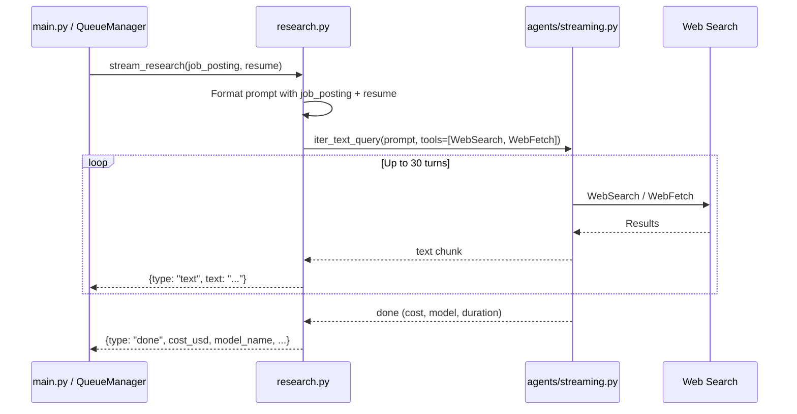

# Research Agent — Low-Level Design

**File**: `app/agents/research.py`

## Overview

Deep-dive company research agent that uses the active AI provider's web search capabilities to investigate a target company across five dimensions: company overview, leadership & culture, reputation & sentiment, products & technology, and challenges & opportunities.

All AI calls go through the provider abstraction in `agents/streaming.py`, which selects between Claude (Anthropic), GPT (OpenAI), or Ollama based on the active configuration.

## Functions

### `run_research(job_posting: str, resume: str = "") -> dict`

Runs the company research agent asynchronously. Blocks until complete.

**Parameters**:
- `job_posting` — Full job description text (used to identify the company and role)
- `resume` — Candidate resume for fit assessment (optional)

**Returns**: `dict` with keys:
- `raw_report: str` — Full markdown research report
- `cost_usd: float` — API cost for this run
- `model_name: str` — Model used
- `duration_ms: int` — Execution time in milliseconds
- `ran_at: str` — ISO timestamp of execution

### `stream_research(job_posting: str, resume: str = "") -> AsyncIterator[dict]`

Streaming variant. Yields SSE-compatible event dicts as the agent produces output:
- `{"type": "text", "text": "..."}` — incremental text chunks
- `{"type": "done", "cost_usd": ..., "model_name": ..., "duration_ms": ..., "ran_at": ...}` — final summary

**Agent Configuration**:
| Option | Value | Rationale |
|--------|-------|-----------|
| `max_turns` | 30 | Research requires many search iterations to cover 5 dimensions |
| `tools` | `["WebSearch", "WebFetch"]` | Needs web access for real-time company data |

## Research Dimensions

1. **Company Overview** — Business model, founding, size, industry, funding, revenue, growth
2. **Leadership & Culture** — Key leaders, management style, employee reviews, engineering culture
3. **Reputation & Sentiment** — Overall sentiment, green/red flags, compensation signals
4. **Products & Technology** — Products, tech stack, scale indicators
5. **Challenges & Opportunities** — Business, technical, organizational challenges

Each finding is tagged with confidence: `[VERIFIED]`, `[LIKELY]`, or `[SPECULATIVE]`.

## Sequence Diagram

