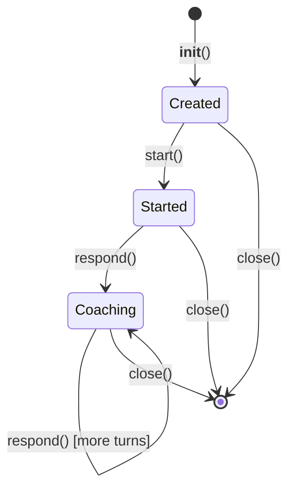

# Resume Chat Agent — Low-Level Design

**File**: `app/agents/resume_chat.py`

## Overview

Manages interactive resume coaching conversations. Like `MockInterviewSession`, this maintains persistent multi-turn conversation state — but focused on back-and-forth resume tailoring rather than interview simulation.

## Class: ResumeChatSession

### Constructor

```python
ResumeChatSession(
    job_posting: str,
    resume: str,
    jd_analysis: str = "",
    research: str = ""
)
```

### Instance Attributes

| Attribute | Type | Description |
|-----------|------|-------------|
| `job_posting` | `str` | Job description |
| `resume` | `str` | Current resume text |
| `jd_analysis` | `str` | JD decode output (optional context) |
| `research` | `str` | Company research output (optional context) |
| `history` | `list[dict]` | Message history (role + content) |
| `is_started` | `bool` | Whether the session has begun |

### Methods

#### `async start() -> str`

Sends the opening context to the AI and returns the coach's initial analysis and first prompt.

#### `async respond(user_message: str) -> str`

Sends the user's message, receives the coach's next response.

#### `async close()`

Cleans up any session resources.

### Lifecycle



### Session Management (in main.py)

Active resume chat sessions are stored in `active_resume_chats: dict[str, tuple[ResumeChatSession, float]]` where the float is the last-activity timestamp. Session management mirrors `MockInterviewSession`:

- **Session key format**: `{state_id}_resume_chat`
- **TTL**: 30 minutes of inactivity triggers cleanup
- **Cleanup**: Runs before creating new sessions

### API Endpoints

| Method | Path | Description |
|--------|------|-------------|
| `POST` | `/api/{state_id}/resume-chat/start` | Start a new resume coaching session |
| `POST` | `/api/{state_id}/resume-chat/respond` | Continue the coaching conversation |
