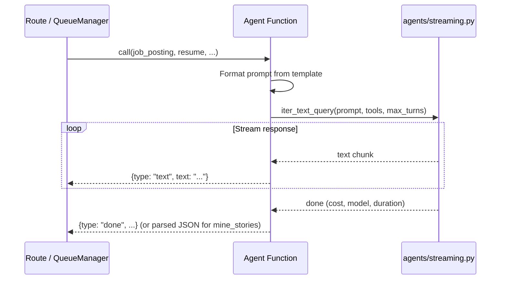

# Story Miner Agent — Low-Level Design

**File**: `app/agents/story_miner.py`

## Overview

Multi-function agent module containing six distinct coaching capabilities: interview intel mining, STAR story extraction, JD decoding, salary coaching, concern anticipation, and pitch building. Each function uses a separate tailored prompt and agent configuration.

All AI calls go through the provider abstraction in `agents/streaming.py`. Every function has both a blocking variant and a streaming variant (prefixed `stream_`).

## Functions

### `run_interview_intel(job_posting: str, company_name: str = "") -> dict`

Mines interview process intelligence from community sources (Glassdoor, Blind, Reddit, Levels.fyi).

**Returns**: `dict` with keys: `raw_report`, `cost_usd`, `model_name`, `duration_ms`, `ran_at`

**Agent Configuration**: `max_turns=15`, tools: `["WebSearch", "WebFetch"]` (searches community sites).

---

### `mine_stories(resume: str, job_posting: str, existing_stories: str = "None") -> list[dict]`

Extracts 5-10 STAR stories from a resume, avoiding duplicates of existing stories.

**Parameters**:
- `resume` — Candidate resume text
- `job_posting` — Job description for relevance scoring
- `existing_stories` — Text representation of existing stories (to avoid duplication)

**Returns**: `list[dict]` — Each dict has keys: `title`, `situation`, `task`, `action`, `result`, `earned_secret`, `tags`, `fit_scores`

**JSON Parsing**: The agent is instructed to return JSON, but the function includes fallback parsing for markdown-fenced responses (` ```json ... ``` `). If JSON parsing fails entirely, returns a single raw story for manual processing.

**Agent Configuration**: `max_turns=5`, no tools (pure reasoning).

---

### `decode_jd(job_posting: str) -> str`

Analyzes a job description through six lenses.

**Returns**: `str` — Markdown analysis text

**Six Lenses**:
1. Repetition Frequency — word/phrase frequency reveals true priorities
2. Order & Emphasis — position and text volume reveal importance
3. Required vs Nice-to-Have — separate hard requirements from wish-list
4. Verb Choices — active vs passive verbs reveal role scope
5. Between-the-Lines Signals — decode corporate speak
6. What's Missing — conspicuous absences

**Agent Configuration**: `max_turns=5`, no tools.

---

### `salary_coach(job_posting: str, resume: str = "") -> str`

Generates comprehensive salary negotiation coaching.

**Returns**: `str` — Markdown coaching text with scripts and ranges

**Agent Configuration**: `max_turns=10`, tools: `["WebSearch"]` (for market data lookup).

---

### `anticipate_concerns(job_posting: str, resume: str) -> str`

Identifies likely interviewer concerns and prepares counter-evidence with reframe scripts.

**Returns**: `str` — Markdown analysis with 5+ concerns ranked by likelihood

**Agent Configuration**: `max_turns=5`, no tools.

---

### `build_pitches(job_posting: str, resume: str) -> str`

Creates multi-format pitch variants (10s, 30s, 60s, 90s + value proposition).

**Returns**: `str` — Markdown with all pitch variants

**Agent Configuration**: `max_turns=5`, no tools.

## Streaming Variants

Each function above has a corresponding `stream_<name>()` variant that yields SSE-compatible event dicts:
- `{"type": "text", "text": "..."}` — incremental text chunk
- `{"type": "done", "cost_usd": ..., "model_name": ..., "duration_ms": ..., "ran_at": ...}` — completion metadata

## Common Pattern

All functions follow the same async pattern:


