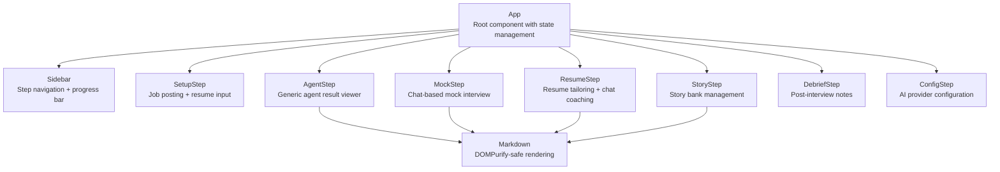

# Frontend — Low-Level Design

**File**: `app/static/index.html`

## Overview

Single-file React SPA served by FastAPI as static HTML. Uses CDN-loaded React 18, Babel (for JSX transpilation in-browser), Tailwind CSS, Marked.js (markdown rendering), and DOMPurify (XSS prevention).

## Component Hierarchy

## Shared Components

### `Markdown({ text })`
Renders markdown text to sanitized HTML using `marked.parse()` + `DOMPurify.sanitize()`.

### `LoadingDots({ label })`
Animated typing indicator shown while agents are processing.

### `api` (API Client Object)
Wraps `fetch()` for `POST`, `GET`, `PUT`, and `DELETE` requests with JSON parsing and error handling.

## Workflow Steps

Each step maps to a step ID and renders the appropriate component:

| Step ID | Component | Description |
|---------|-----------|-------------|
| `setup` | `SetupStep` | Job posting textarea, resume upload/paste, company name + position input |
| `research` | `AgentStep` | Triggers company research, shows markdown report |
| `interview_intel` | `AgentStep` | Mines interview process intel from community sources |
| `jd_decode` | `AgentStep` | Triggers JD decode, shows six-lens analysis |
| `stories` | `StoryStep` | Mine stories + manual add/delete + story cards |
| `resume_review` | `ResumeStep` | AI resume review + tailoring editor + resume chat coaching |
| `pitch` | `AgentStep` | Triggers pitch building, shows pitch variants |
| `concerns` | `AgentStep` | Triggers concern anticipation, shows analysis |
| `mock_interview` | `MockStep` | Chat interface for multi-turn mock interview |
| `salary` | `AgentStep` | Triggers salary coaching, shows negotiation scripts |
| `debrief` | `DebriefStep` | Textarea for post-interview notes |

## State Management

All state is managed in the `App` component via React `useState`:

| State Variable | Type | Description |
|----------------|------|-------------|
| `stateId` | `string \| null` | Current workflow state ID |
| `currentStep` | `string` | Active step ID |
| `completedSteps` | `string[]` | Steps completed so far |
| `existingStates` | `object[]` | Previously saved workflows (for resume) |
| `stepResults` | `object` | Cached agent results per step |
| `queueStatus` | `object` | Current queue snapshot (running, queued, failed) |

State is loaded from the API on mount (`GET /api/states`) and on workflow selection (`GET /api/state/{id}`). Queue state is updated via SSE (`GET /api/queue/stream`).

## Security

- **XSS Prevention**: All markdown from AI agents is rendered through `DOMPurify.sanitize()` before `dangerouslySetInnerHTML`
- **File Upload**: Client-side extension and size validation mirrors server-side checks
- **No credentials in frontend**: API keys are server-side only; the config page POSTs them to the backend which stores them in environment variables
