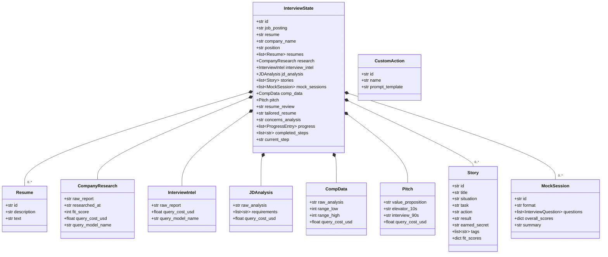

# Low-Level Design — Interview Flow

## Architecture Overview



## Package Structure

```
interview-workflow/
├── app/
│   ├── main.py                 # FastAPI routes and orchestration
│   ├── models.py               # Pydantic data models
│   ├── state.py                # JSON file persistence layer
│   ├── queue_manager.py        # Background queue for agent tasks + SSE
│   ├── prompt_loader.py        # Agent prompt template loader
│   ├── desktop.py              # Native desktop window launcher
│   ├── tracing.py              # Langfuse observability integration
│   └── agents/
│       ├── streaming.py        # Provider abstraction (Claude/OpenAI/Ollama) + cost tracking
│       ├── research.py         # Company research agent
│       ├── story_miner.py      # Story mining, JD decode, salary, concerns, pitches, intel
│       ├── mock_interview.py   # Multi-turn mock interview session
│       └── resume_chat.py      # Interactive resume coaching chat
├── app/static/
│   └── index.html              # React SPA frontend
├── data/                       # Runtime state files (gitignored)
├── tests/
│   ├── app/                    # Unit and integration tests
│   │   ├── conftest.py         # SDK mocking setup
│   │   └── ...
│   └── e2e/                    # End-to-end Playwright tests
└── docs/
    ├── hld/                    # High-level design
    └── lld/                    # Low-level design (this directory)
```

## Component Documentation

### Models
- [models.md](models.md) — All Pydantic data models: InterviewState, Story, MockSession, CompanyResearch, InterviewIntel, JDAnalysis, CompData, Pitch, Resume, CustomAction, ProgressEntry, and request/response schemas

### State Management
- [state.md](state.md) — Combined JSON file persistence with atomic writes, path traversal prevention, global async locking, and custom actions persistence

### Queue System
- Queue manager (`app/queue_manager.py`) — In-memory background processing queue with SSE event streaming; one task runs at a time, ordered by `SECTION_ORDER`

### Agents
- [agents/research.md](agents/research.md) — Company research agent using web search
- [agents/story_miner.md](agents/story_miner.md) — Story extraction, interview intel, JD decoding, salary coaching, concern anticipation, pitch building
- [agents/mock_interview.md](agents/mock_interview.md) — Multi-turn mock interview session manager
- [agents/resume_chat.md](agents/resume_chat.md) — Interactive resume coaching chat session

### API Routes
- [routes.md](routes.md) — All FastAPI endpoints with request/response schemas and flow diagrams

### Frontend
- [frontend.md](frontend.md) — React SPA architecture, component hierarchy, and API integration
