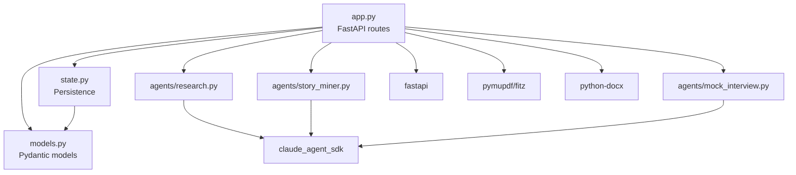

# Package / Module Hierarchy

## Runtime Dependencies

| Package | Version | Purpose |
|---------|---------|---------|
| `fastapi` | `>=0.115.0` | HTTP framework, routing, request validation |
| `uvicorn` | `>=0.34.0` | ASGI server |
| `claude-agent-sdk` | `>=0.1.0` | Claude AI agent interface (query, streaming, tools) |
| `python-multipart` | `>=0.0.18` | File upload support for FastAPI |
| `pydantic` | `>=2.10.0` | Data models, validation, JSON serialization |
| `pymupdf` | `>=1.24.0` | PDF text extraction (fitz) |
| `python-docx` | `>=1.1.0` | DOCX text extraction |

## Module Dependency Graph

## Test Dependencies

| Package | Purpose |
|---------|---------|
| `pytest` | Test runner |
| `pytest-asyncio` | Async test support |
| `httpx` | FastAPI TestClient backend |

## Module Responsibilities

| Module | Imports From | Exports |
|--------|-------------|---------|
| `models.py` | pydantic, uuid, datetime | All domain models + request schemas |
| `state.py` | models, pathlib, asyncio | `save_state`, `load_state`, `list_states`, `delete_state` |
| `agents/research.py` | claude_agent_sdk | `run_research()` |
| `agents/story_miner.py` | claude_agent_sdk, json | `mine_stories()`, `decode_jd()`, `salary_coach()`, `anticipate_concerns()`, `build_pitches()` |
| `agents/mock_interview.py` | claude_agent_sdk | `MockInterviewSession` class |
| `app.py` | all of the above, fastapi | FastAPI `app` instance |
