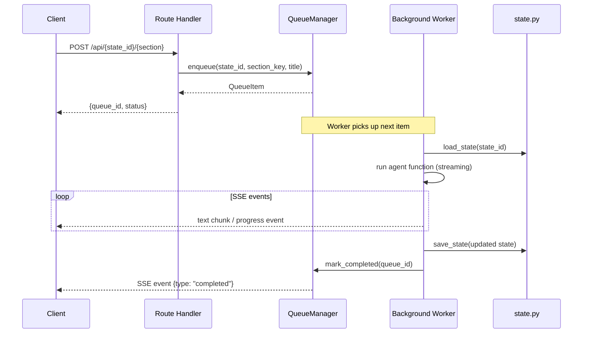
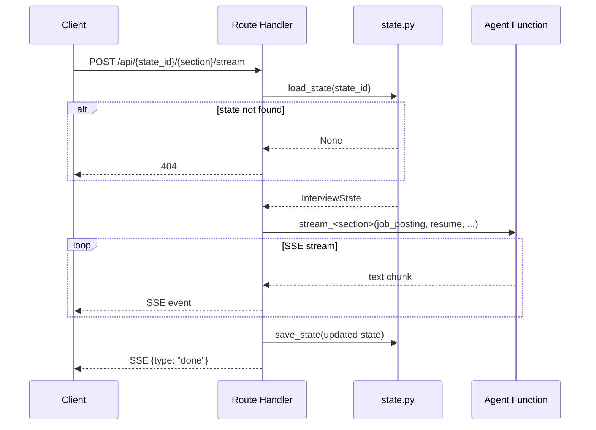
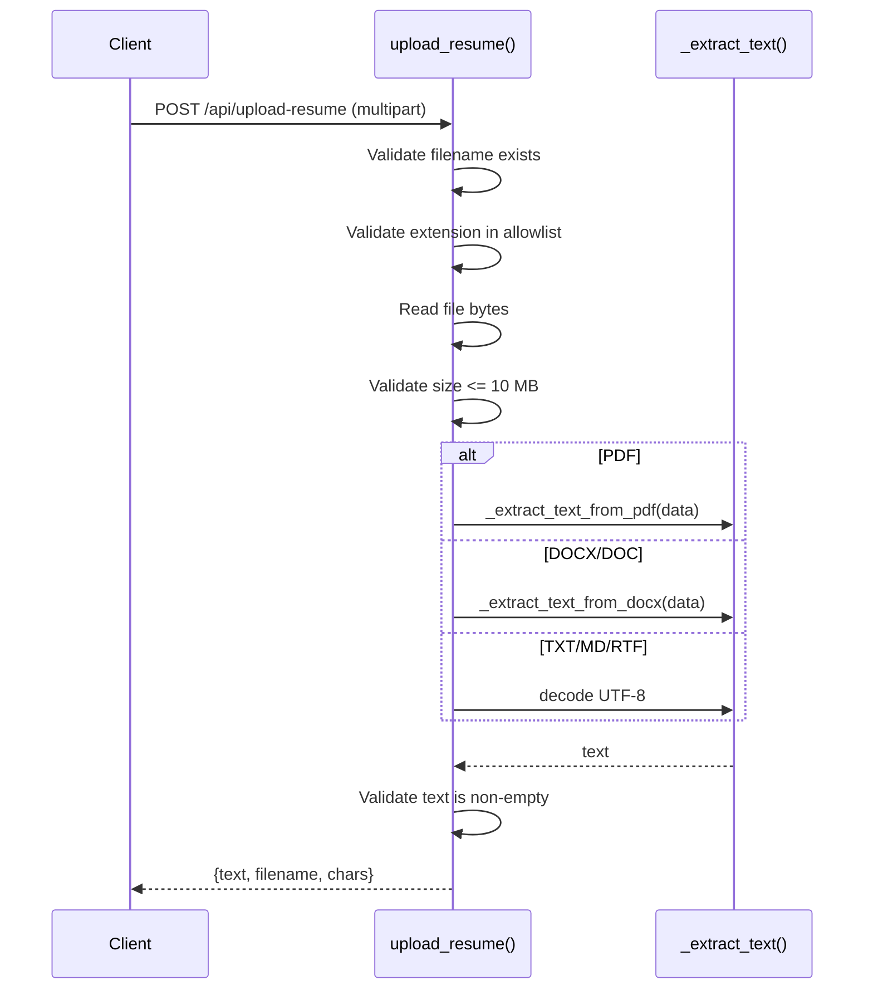

# API Routes — Low-Level Design

**File**: `app/main.py`

## Overview

FastAPI application serving both the REST API and the static frontend. All API routes are prefixed with `/api/`. State-specific operations are scoped to a `state_id` path parameter. Long-running agent tasks are dispatched through the queue manager rather than executed synchronously; the frontend subscribes to SSE streams for progress updates.

## Endpoint Reference

### Frontend

| Method | Path | Description |
|--------|------|-------------|
| `GET` | `/` | Serves the static HTML frontend |

### Configuration

| Method | Path | Description |
|--------|------|-------------|
| `GET` | `/api/config` | Get current AI provider configuration |
| `POST` | `/api/config` | Update AI provider settings (provider, model, API keys) |
| `GET` | `/api/ollama/models` | List locally available Ollama models |

### Data Management

| Method | Path | Description |
|--------|------|-------------|
| `POST` | `/api/data/copy` | Copy data to a new location |
| `POST` | `/api/data/verify` | Verify data at a target location |
| `POST` | `/api/data/delete-originals` | Delete original data files after migration |
| `POST` | `/api/data/apply-location` | Apply a new data directory location |

### State Management

| Method | Path | Description |
|--------|------|-------------|
| `GET` | `/api/states` | List all saved workflow states (summaries) |
| `POST` | `/api/setup` | Create a new workflow state |
| `POST` | `/api/{state_id}/setup-update` | Update job posting / resume on an existing state |
| `POST` | `/api/{state_id}/refetch-jd` | Re-fetch job description from a URL |
| `GET` | `/api/state/{state_id}` | Get full state object |
| `DELETE` | `/api/state/{state_id}` | Delete a workflow state |
| `POST` | `/api/state/{state_id}/clone` | Clone a workflow state |

### File Upload

| Method | Path | Description |
|--------|------|-------------|
| `POST` | `/api/upload-resume` | Upload and extract text from a resume file |

**Supported formats**: `.pdf`, `.docx`, `.doc`, `.txt`, `.md`, `.rtf`  
**Max size**: 10 MB

### Queue System

| Method | Path | Description |
|--------|------|-------------|
| `GET` | `/api/queue` | Get current queue snapshot (running, queued, failed) |
| `POST` | `/api/queue` | Enqueue a section for background processing |
| `DELETE` | `/api/queue/{queue_id}` | Remove a waiting item from the queue |
| `POST` | `/api/queue/{queue_id}/cancel` | Cancel a running or waiting item |
| `GET` | `/api/queue/stream` | SSE stream of queue state changes |
| `GET` | `/api/queue/{queue_id}/events` | SSE stream of events for a specific queue item |

### Agent Endpoints — Queue-Backed

These endpoints enqueue the work and return immediately. Progress streams via the queue SSE endpoints.

| Method | Path | Section Key | Description |
|--------|------|------------|-------------|
| `POST` | `/api/{state_id}/research` | `research` | Company deep-dive research |
| `POST` | `/api/{state_id}/interview-intel` | `interview_intel` | Mine interview process intel from community sources |
| `POST` | `/api/{state_id}/decode-jd` | `jd_decode` | Six-lens JD analysis |
| `POST` | `/api/{state_id}/resume-review` | `resume_tailor` | AI review of resume vs JD fit |
| `POST` | `/api/{state_id}/stories/mine` | `stories` | Extract STAR stories from resume |
| `POST` | `/api/{state_id}/salary` | `salary` | Salary negotiation coaching |
| `POST` | `/api/{state_id}/concerns` | `concerns` | Anticipate interviewer concerns |
| `POST` | `/api/{state_id}/pitch` | `pitch` | Build pitch variants |

### Agent Endpoints — Direct Stream (SSE)

Legacy streaming endpoints that run the agent directly and stream output without going through the queue. Used for resume-specific streaming tasks.

| Method | Path | Description |
|--------|------|-------------|
| `POST` | `/api/{state_id}/research/stream` | Stream company research directly |
| `POST` | `/api/{state_id}/interview-intel/stream` | Stream interview intel directly |
| `POST` | `/api/{state_id}/decode-jd/stream` | Stream JD decode directly |
| `POST` | `/api/{state_id}/resume-review/stream` | Stream resume review directly |
| `POST` | `/api/{state_id}/stories/mine/stream` | Stream story mining directly |
| `POST` | `/api/{state_id}/salary/stream` | Stream salary coaching directly |
| `POST` | `/api/{state_id}/concerns/stream` | Stream concerns analysis directly |
| `POST` | `/api/{state_id}/pitch/stream` | Stream pitch building directly |

### Resume Management

| Method | Path | Description |
|--------|------|-------------|
| `GET` | `/api/{state_id}/resumes` | List resumes in this state's library |
| `POST` | `/api/{state_id}/resumes` | Add a resume to the library |
| `POST` | `/api/{state_id}/resumes/{resume_id}/select` | Set a saved resume as the active resume |
| `DELETE` | `/api/{state_id}/resumes/{resume_id}` | Delete a resume from the library |
| `POST` | `/api/{state_id}/resume-update` | Update the active resume text |
| `POST` | `/api/{state_id}/resume-download` | Download resume as DOCX |
| `POST` | `/api/{state_id}/resume-export` | Export tailored resume |

### Resume Chat

| Method | Path | Description |
|--------|------|-------------|
| `POST` | `/api/{state_id}/resume-chat/start` | Start an interactive resume coaching session |
| `POST` | `/api/{state_id}/resume-chat/respond` | Send a message and get the next coaching response |

### Story Management

| Method | Path | Description |
|--------|------|-------------|
| `GET` | `/api/{state_id}/stories` | List all stories |
| `POST` | `/api/{state_id}/stories/add` | Add a manual story |
| `DELETE` | `/api/{state_id}/stories/{story_id}` | Delete a story |

### Mock Interview

| Method | Path | Description |
|--------|------|-------------|
| `POST` | `/api/{state_id}/mock/start` | Start a new mock interview session |
| `POST` | `/api/{state_id}/mock/respond` | Send candidate response, get next question |

### Debrief & Progress

| Method | Path | Description |
|--------|------|-------------|
| `POST` | `/api/{state_id}/debrief` | Save debrief notes |
| `POST` | `/api/{state_id}/progress` | Add a progress tracking entry |

### Custom Actions

| Method | Path | Description |
|--------|------|-------------|
| `GET` | `/api/custom-actions` | List all global custom actions |
| `POST` | `/api/custom-actions` | Create a new custom action |
| `PUT` | `/api/custom-actions/{action_id}` | Update a custom action |
| `DELETE` | `/api/custom-actions/{action_id}` | Delete a custom action |
| `POST` | `/api/custom-actions/{action_id}/run/stream` | Run a custom action and stream output |

---

## Queue-Backed Route Pattern

Agent endpoints that use the queue follow this flow:

## Direct Agent Route Pattern (Legacy)

For direct-stream endpoints:

## Middleware

- **CORS**: Allows localhost origins
- **Static files**: `/static/` path serves `static/` directory

## Error Handling

All agent endpoints catch exceptions, log the full traceback via `logger.exception()`, and return HTTP 500 with an error message (or publish an error event to SSE subscribers for queue-backed flows).

## File Upload Flow

