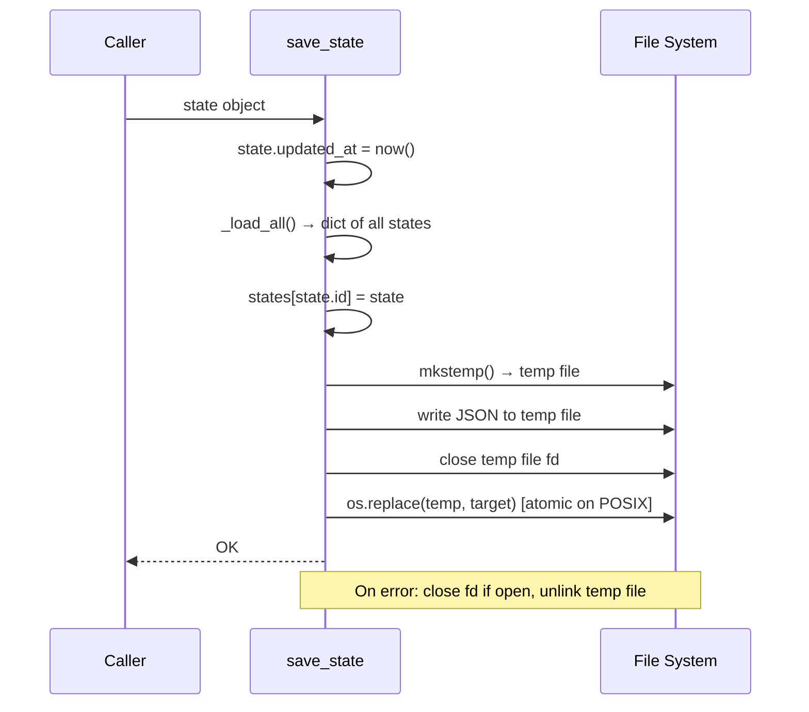
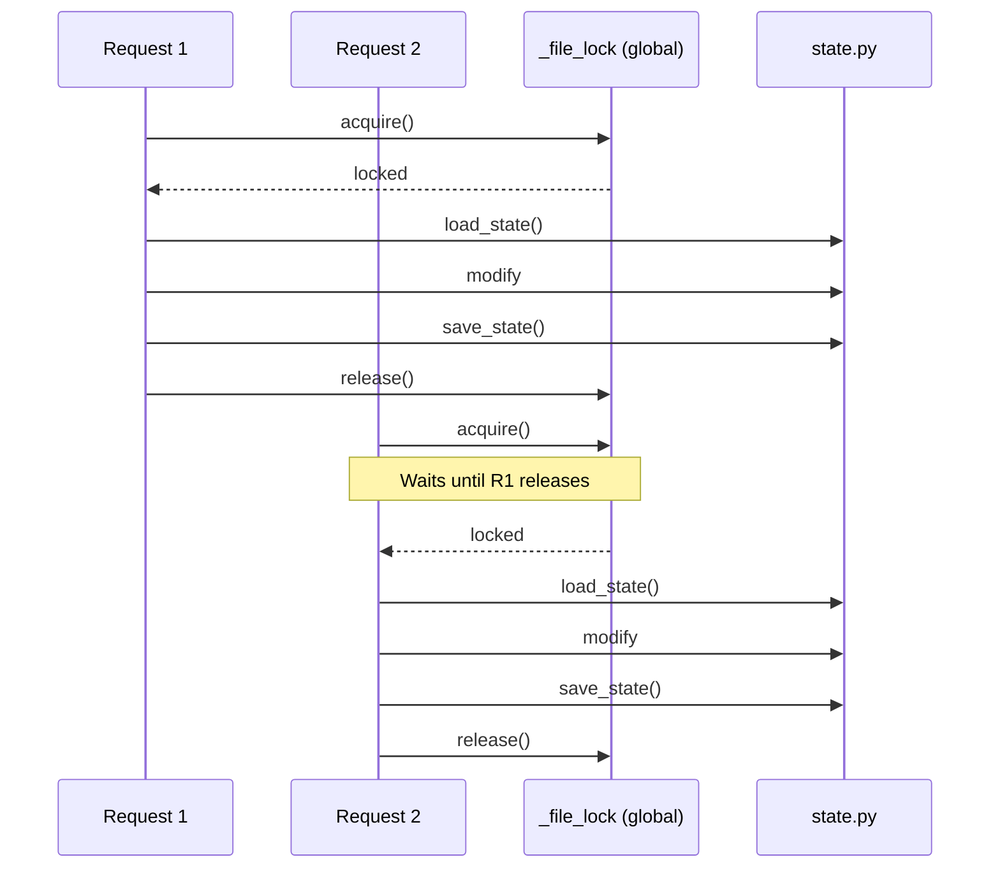

# State Manager — Low-Level Design

**File**: `app/state.py`

## Overview

Persistent state manager that saves all `InterviewState` objects together in a single combined JSON file. Provides atomic writes (temp file + rename), state ID validation to prevent path traversal, and a global async lock to serialize all writes.

A separate file (`custom-actions.json`) stores global custom actions using the same atomic write pattern.

## Constants

| Constant | Value | Purpose |
|----------|-------|---------|
| `DATA_DIR` | `./data/` (or `$INTERVIEW_DATA_DIR`) | Directory for data files |
| `DATA_FILE_NAME` | `"interview-flow-data.json"` | Combined state file for all sessions |
| `CUSTOM_ACTIONS_FILE_NAME` | `"custom-actions.json"` | Global custom actions file |
| `_SAFE_ID` | `^[a-f0-9]{12}$` | Regex for valid state IDs (prevents path traversal) |
| `_file_lock` | `asyncio.Lock` | Single global lock (all states share one file) |

`DATA_DIR` defaults to `data/` next to the package root but is overridden by the `INTERVIEW_DATA_DIR` environment variable. The desktop launcher uses this to redirect writes to a user-writable location when running as a frozen PyInstaller bundle.

## Functions

### `_validate_id(state_id: str) -> None`

Validates that a state ID matches the safe hex pattern. Raises `ValueError` for invalid IDs.

- **Security**: Prevents path traversal attacks (e.g., `../../etc/passwd`)

### `get_lock(state_id: str) -> asyncio.Lock`

Returns the single global file lock. The `state_id` argument is accepted for interface compatibility but ignored — all sessions share one file, so all writes must be serialized through one lock.

### `set_data_dir(new_dir: Path) -> None`

Switches `DATA_DIR` at runtime. Used after a successful data migration (e.g., on first launch to move data to a user-writable location).

### `save_state(state: InterviewState) -> None`

Adds or updates a session in the combined data file using the write-to-temp-then-rename pattern.

### `load_state(state_id: str) -> InterviewState | None`

Loads a single session by ID from the combined file. Returns `None` for invalid IDs or missing sessions.

### `list_states() -> list[dict]`

Returns summaries of all saved sessions, sorted by `updated_at` (newest first). Each summary includes `id`, `company_name`, `position`, `current_step`, `completed_steps`, `created_at`, `updated_at`. Skips corrupt entries with a warning log.

### `list_resume_library(preferred_state_id: str = "") -> list[Resume]`

Returns a deduplicated resume library across all saved sessions. The preferred state's resumes are listed first; deduplication is by `description` (case-insensitive).

### `delete_state(state_id: str) -> bool`

Removes a session from the combined file. Returns `True` if it existed, `False` if not found or invalid ID.

### `load_custom_actions() -> list[CustomAction]`

Loads the global custom actions list from `custom-actions.json`. Returns `[]` if the file does not exist.

### `save_custom_actions(actions: list[CustomAction]) -> None`

Atomically writes the global custom actions list using the same write-to-temp-then-rename pattern.

## Concurrency Model

All sessions share a single JSON file, so a single global `asyncio.Lock` serializes all writes.

Route handlers must acquire the lock via `async with get_lock(state_id):` around read-modify-write cycles to prevent lost updates.
